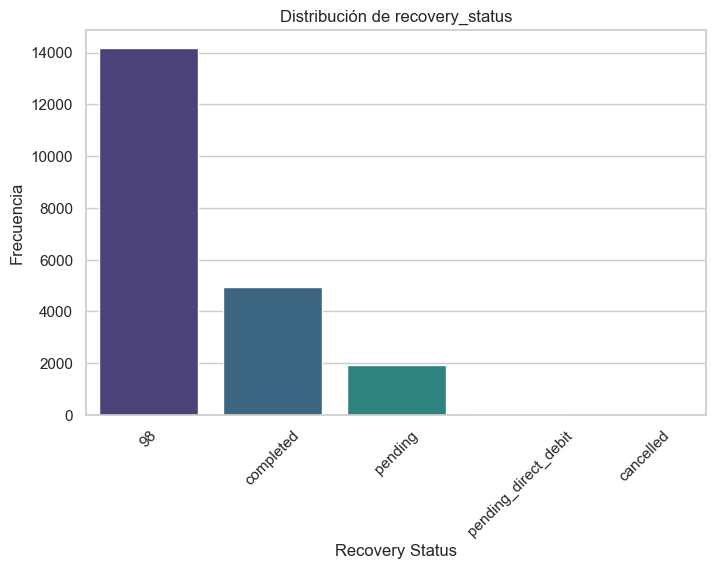
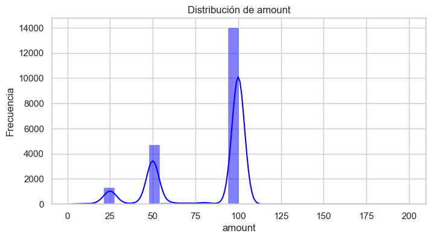
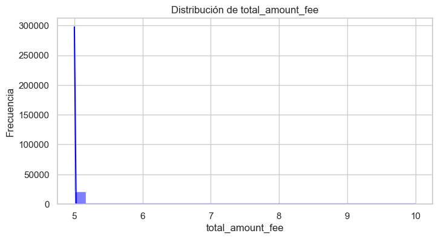
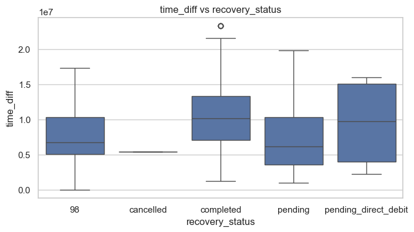
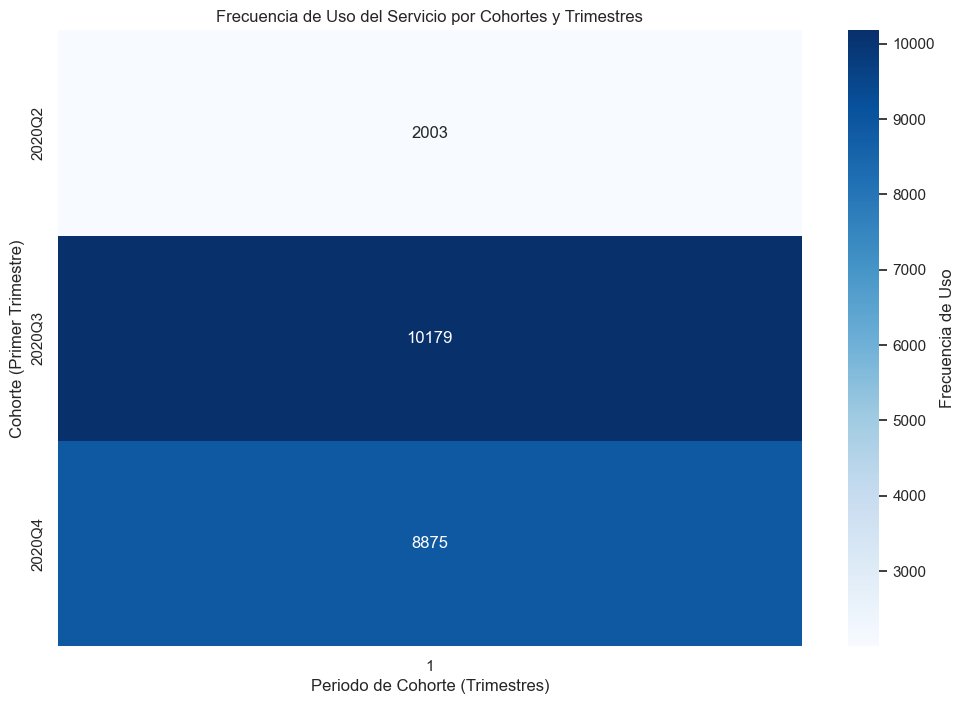
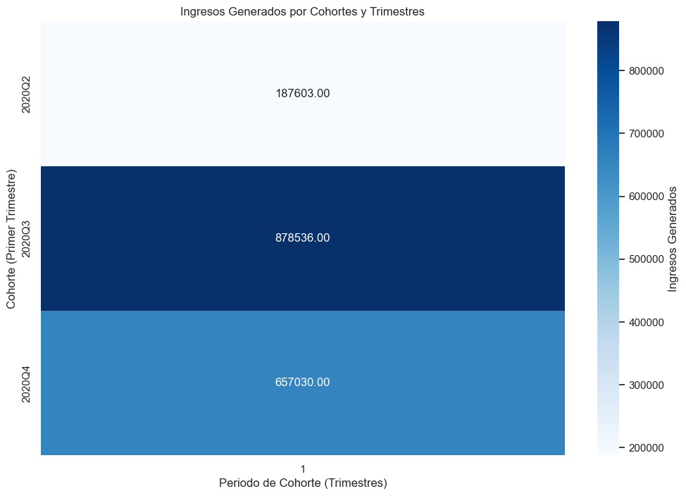
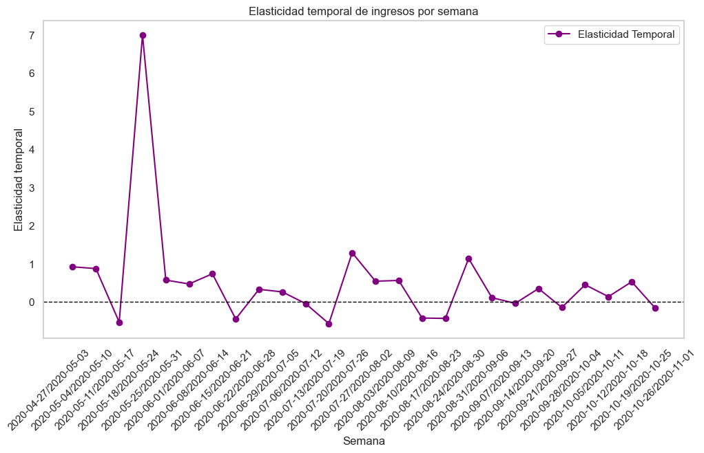
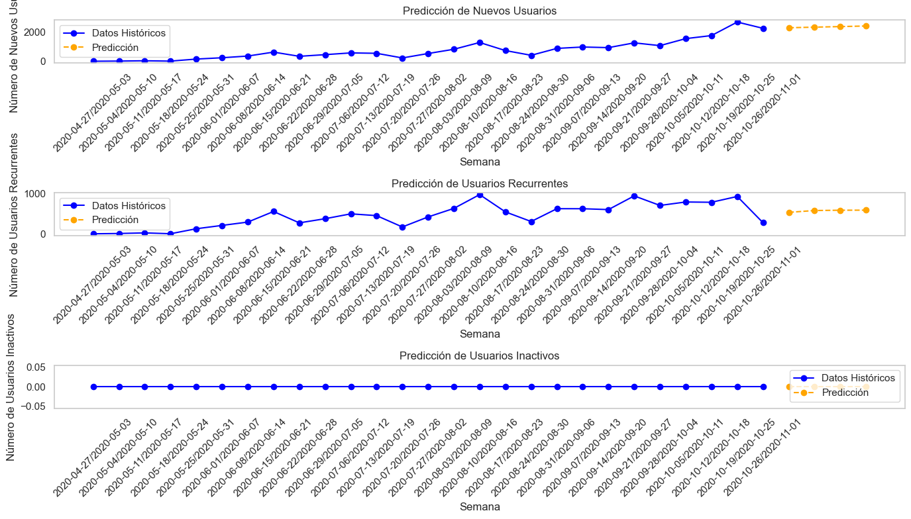
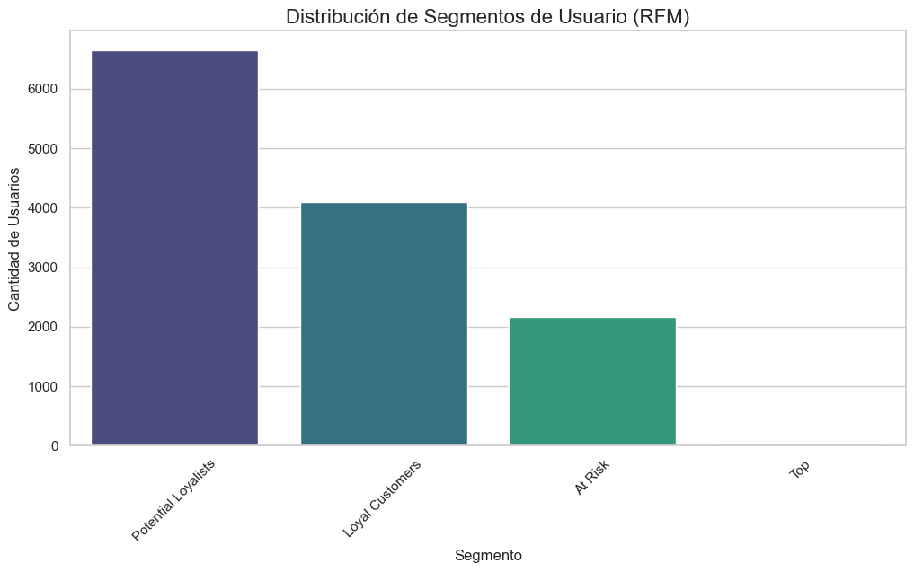

# Análisis de Insights y Cohortes Avanzados para los Pagos de Business Payments

## Introducción

Business Payments, una empresa de servicios financieros de vanguardia, ha estado ofreciendo soluciones innovadoras de adelanto de efectivo desde su creación en 2020. Con un compromiso de proporcionar adelantos de dinero gratuitos y precios transparentes, Business Payments ha logrado construir una base de usuarios sólida. Como parte de su esfuerzo continuo por mejorar sus servicios y entender el comportamiento de los usuarios, Business Payments encargó este proyecto a nuestro equipo para realizar un análisis avanzado de insights y cohortes.

Equipo:

- Cristian Largo Reina
- Albert Bañeres Rovirosa
- Elvis Ortega Ochoa

Se puede ver la organización y planificación de las tareas del equipo en la pestaña Projects --- https://github.com/elvisortegaec/businessPayments/projects

## Visión General del Proyecto

En este proyecto, se realizó una extracción de insights accionables, un análisis avanzado de cohortes y una segmentación de datos exhaustiva proporcionada por Business Payments. El objetivo principal fue analizar cohortes de usuarios relevantes, definidas según el período en el que realizaron su primer adelanto de efectivo. Además, se seguió la evolución temporal de métricas clave para estas cohortes y se propuso insights relevantes, así como modelos de regresión y clasificación, que permitirán a Business Payments obtener valiosas perspectivas sobre el comportamiento de los usuarios y el rendimiento de sus servicios financieros.

## Informe Resumido
Este es un informe resumido de los hallazgos clave del análisis exploratorio y de calidad de datos, así como los insights obtenidos, diseñado para los stakeholders de Business Payments.

### Hallazgos Clave de la Calidad de Datos
TBD

### Hallazgos Clave del Análisis Exploratorio
Resultados del análisis exploratorio de los Datos, utilizando diversas gráficas para representar la distribución, explorar relaciones entre variables y detectar valores atipicos que requieran una investigación específica.

**Visualizamos la variable Recovery status**:

Inicialmente realizamos un grafico de barras de la variable Recovery Status para ver su distribución ya que es la que queremos predecir inicialmente:

*La mayor parte de los valores se encuentran como que nunca se ha recibido ninguna incidencia sobre ese cash request*

*Sobre los otros posibles valores, se indica si una vez creada la incidencia se ha completado, pendiente, cancelada o pendiente pero con una transferencia SEPA en proceso.

**Análisis Univariado**

## Resumen de estadísticas de variables numéricas

| Variable            | Count     | Mean          | Std           | Min           | 25%          | 50%          | 75%          | Max           |
|---------------------|-----------|---------------|---------------|---------------|--------------|--------------|--------------|---------------|
| id                 | 21057     | 16318.45      | 6656.15       | 1456.00       | 11745.00     | 17160.00     | 21796.00     | 27010.00      |
| amount             | 21057     | 81.83         | 26.95         | 1.00          | 50.00        | 100.00       | 100.00       | 200.00        |
| deleted_account_id | 21057     | 94634827.00   | 20063077.00   | 3857.00       | 98888889.00  | 98888889.00  | 98888889.00  | 98888889.00   |
| id_fee             | 21057     | 10646.67      | 6099.14       | 1.00          | 5388.00      | 10654.00     | 15926.00     | 21193.00      |
| cash_request_id    | 21057     | 16318.45      | 6656.15       | 1456.00       | 11745.00     | 17160.00     | 21796.00     | 27010.00      |
| total_amount_fee   | 21057     | 5.00          | 0.03          | 5.00          | 5.00         | 5.00         | 5.00         | 10.00         |
| time_diff          | 21057     | 8327430.00    | 3754475.00    | 24.34         | 5172280.00   | 7416928.00   | 11060680.00  | 23307870.00   |

**amount** *tiene un comportamiento sesgado hacia valores altos (mediana en 100). Esto podría afectar la predicción y merece exploración.*

**total_amount_fee** *parece una variable discreta con un rango pequeño (5-10), lo que la hace menos informativa.*

**time_diff** *tiene una variación significativa y podría ser clave en la predicción si se relaciona con recovery_status.*

`Variables categóricas`

## Frecuencias de las Variables Categóricas Principales

### **Status**
| Status                   | Frecuencia |
|--------------------------|------------|
| money_back               | 18,918     |
| direct_debit_rejected    | 1,858      |
| active                   | 155        |
| direct_debit_sent        | 72         |
| transaction_declined     | 48         |
| canceled                 | 6          |

---

### **User ID**
| User ID      | Frecuencia |
|--------------|------------|
| Null         | 906        |
| 16391.0      | 37         |
| 15593.0      | 28         |
| 3045.0       | 25         |
| 17144.0      | 24         |
| ...          | ...        |

---

### **Charge Moment Fee**
| Charge Moment Fee | Frecuencia |
|-------------------|------------|
| after            | 16,720     |
| before           | 4,337      |

**Análisis Bivariado**

## Estadísticas Agrupadas por `recovery_status`

| Recovery Status      | ID          | Amount    | Deleted Account ID | ID Fee      | Cash Request ID | Total Amount Fee | Time Diff     |
|----------------------|-------------|-----------|---------------------|-------------|-----------------|------------------|---------------|
| 98                   | 17565.16    | 82.17     | 9.56e+07           | 11195.31    | 17565.16        | 5.000353         | 7.82e+06      |
| Cancelled            | 23127.00    | 100.00    | 9.89e+07           | 16008.00    | 23127.00        | 5.000000         | 5.36e+06      |
| Completed            | 13851.78    | 81.26     | 9.15e+07           | 9281.89     | 13851.78        | 5.000000         | 1.01e+07      |
| Pending              | 13494.55    | 80.71     | 9.58e+07           | 10130.27    | 13494.55        | 5.000000         | 7.38e+06      |
| Pending Direct Debit | 14515.85    | 85.59     | 9.89e+07           | 9516.35     | 14515.85        | 5.000000         | 9.42e+06      |

**Correlación entre variables Numéricas**

**Distribución de Transfer Type vs Recovery Stats**

**Distribución de Time Diff vs Recovery Stats**

**Variables a tener en cuenta modelo predictivo**

*Ejemplos de variables con un p-value < 0.05 y Chi-cuadrado significativo:*

*moderated_at: chi2=41894.79, p-value=0.000*

*reimbursement_date: chi2=15903.45, p-value=0.000*

*send_at: chi2=69478.84, p-value=0.000*

*type_fee: chi2=5413.51, p-value=0.000*

*status_fee: chi2=9537.93, p-value=0.000*

**Frecuencia de Uso del Servicio segmetado por trimestres**

La frecuencia de uso aumenta drásticamente del segundo al tercer trimestre, pero muestra una ligera reducción en el cuarto trimestre, aunque se mantiene en un nivel alto en comparación con el segundo trimestre. Esto podría indicar un crecimiento inicial en el uso del servicio, seguido de una estabilización.

**Tasa de incidentes**

Hay una clara tendencia a la baja en la tasa de incidentes a medida que avanza el tiempo, lo que podría indicar una mejora en la gestión de incidentes o un cambio positivo en las condiciones subyacentes.

**Ingresos Generados por Cohorte**

La cohorte 2020Q3 generó los mayores ingresos, destacándose como un modelo exitoso que debería replicarse. La cohorte 2020Q4 tiene buen potencial, pero es necesario acelerar la conversión de clientes a estados generadores de ingresos. Optimizar estrategias en cohortes recientes puede maximizar las ganancias futuras.

**Frecuencia de Recovery Status por Cohortes y Trimestres**

El estado predominante es 1-98 en todas las cohortes, indicando que la mayoría de los clientes probablemente tienen ese estado inicial o base.

El número de clientes que completaron (1-completed) el proceso parece ser significativo, especialmente en las cohortes 2020Q3 y 2020Q4.

Estados como 1-cancelled y 1-pending_direct_debit son poco frecuentes, mostrando que son escenarios menos comunes en estos datos.

**Proporción de Recovery Status por Cohortes y Trimestres**

Foco en la conversión: Es crucial investigar por qué en la cohorte 2020Q4, la mayoría de los clientes (80%) no avanzan más allá del estado inicial. Podría ser necesario revisar los procesos internos, la experiencia del cliente o las políticas operativas.

Lecciones de cohortes anteriores: Las cohortes 2020Q2 y 2020Q3 muestran mejores tasas de finalización. Analizar lo que funcionó bien en esos períodos podría ayudar a replicar el éxito con nuevas cohortes.

Estrategias proactivas: Diseñar iniciativas específicas para mover a más clientes hacia 1-completed podría mejorar la eficiencia operativa y generar más ingresos. Esto podría incluir automatización, seguimiento personalizado o incentivos para avanzar en el proceso.

**Frecuencia de Ingresos por semana**

El servicio tiene una tendencia ascendente en la frecuencia de ingresos por semana, con un aumento significativo en los trimestres.

**Elasticidad Temporal de ingresos por semana**

En la semana que incluye el 2020-05-10, la elasticidad temporal alcanza un pico muy alto (superior a 7), sugiriendo un evento o campaña que provocó un gran aumento en los ingresos.

En general, los ingresos son estables a lo largo del tiempo, con oscilaciones moderadas.

**Series Temporales de Tipos de Usuario**

Observamos la clara diferencia de Tendencia entre los nuevos usuarios y la recurrencia de los usuarios ya existentes, indicativo que la captación de nuevos usuarios esta funcionando muy bien pero no se esta logrando la recurrencia de los usuarios ya existentes.

**Predicciones Tipos de Usuario**

Vemos como a pesar de la creciente tendencia que se mantiene sobre los nuevos usarios, cuesta incrementar la retención de ellos, indicativo para mejorar la experiencia de usuario y la calidad del servicio.

**Distribución de Segmentos de Usuario (RFM)**

Observamos como la mayor parte de los usuarios se encuentran en el segundo segmento mas bajo del Estudio, lo que nos podria dar un indicio de que la estrategia de marketing actual no esta siendo efectiva para atraer a todos esos clientes potenciales.

**Distribución de Segmentos de Usuario Potential Loyalist (RFM)**

Recency: Muchos clientes están activos recientemente, lo que sugiere un buen nivel de retención.
Frequency: La baja frecuencia general indica que los clientes interactúan pocas veces y podrían necesitar incentivos para incrementar la frecuencia.
Monetary: Aunque el gasto promedio es moderado, los valores atípicos altos representan clientes con un mayor potencial económico.

**Comparación en Gasto de Segmentos de Usuario (RFM)**

Al igual que en la Distribución de los Segmentos de usuario, esa gran masa donde se encuentran los perfiles que pueden ser potencialmente clientes son los perfiles que estan gastando más en nuestro servicio.

### Hallazgos Clave de Modelos de Regresión Personalizados
Análisis y predicción de transacciones en Business Payments usando regresión lineal, para anticipar incidencias y optimizar la gestión.
Hemos decidido ir a predecir la variable "status" y la variable "recovery_status" para esta rúbrica. 

Podemos ver que los campos que están relacionados son los de ID, variables que a nivel predictorio nos aportan poca capacidad predictiva.

El 40.1% de la variabilidad en la variable dependiente (recovery_status_encoded) está explicada por las variables independientes en el modelo con el R².

También obtenemos que el p-value de distinitas variables es menor a 0,005, lo que nos da una significancia positiva confirmada.

**Regresión Lineal**:

Error Cuadrático Medio (MSE): 0.7876582240511442
R2: 0.35304526580937523
Coeficientes: [-0.00164849 -0.0155265   0.61151403  0.81330906]
Intercepto: 0.5015476024153426

El MSE nos da un valor muy alto, ya que cuanto menor sea menor será el error del modelo.

El R² tampoco captura el 65% de la variabilidad de recovery_status.

Vemos que category_fee(0,8133) y fee_status (0,6115) són las variables que más explican el modelo.

**Regresión Logística para predecir "status"**

Hemos utilizado una regresión logística multinomial para predecir la variable categórica status de un conjunto de datos. En este caso hemos implementado una función sigmoide.

Se usó la función log-loss para medir errores entre predicciones y etiquetas. El modelo obtuvo un **89.53%** de precisión en pruebas después de:

1. Implementar una función log-loss y hacer One-Hot encoding de la variable status (categórica).
2. Entrenar al modelo introduciendo pesos y sesgos.
3. Hacer la predicción con los pesos y los sesgos ya en el modelo.

Concluimos que se muestra un rendimiento sólido y esto implica su capacidad para clasificar correctamente transacciones según su estado.

**Predicción y Recall**

El modelo predice excelentemente la clase "transaction_declined" (90% precisión, 100% recall), pero falla en las otras clases (precisión y F1-score de 0.00). La precisión global es 0.90, dominada por la clase mayoritaria, indicando un problema de desbalance de clases.

Es por eso que introducimos hiperparametros y utilizando el algoritmo SMOTE, creamos de manera sintética observaciones en las clases más desvalanceadas para ver que capacidad de predicción y de recall tiene el modelo entonces:

El recall mejoró en algunas clases como money_sent y waiting_user_confirmation, pero sigue bajo en approved (~0.4) y disminuyó en transaction_declined. Esto indica riesgo de falsos positivos y una predictividad alta solo en transaction_declined.

### Introspección para detectar usuarios potencialmente fraudulentos

Las fintech enfrentan el reto de prevenir fraudes, que aunque representan menos del 0.3% de transacciones, tienen alto impacto. Este análisis identifica patrones sospechosos como montos inusuales, usuarios inactivos y transacciones rechazadas para mitigar riesgos.

**Métricas clave para detectar usuarios fraudulentos**:

1. Filtrar "transaction_declined" o "rejected": Identificar usuarios con alta incidencia en estos estados para detectar patrones sospechosos.
   
2. Transacciones de monto máximo (200): Usuarios con este monto deben considerarse casos sospechosos.
   
3. Diferencial entre created_at y updated_at: Diferencias muy cortas pueden indicar intentos de manipulación o fraude.
 
4. Transacciones entre 1-4 AM: Actividad nocturna inusual puede ser indicativa de fraudes.
 
5. "direct_debit_rejected": Identificar usuarios con rechazos en débitos directos como posible señal de fraude.

Tras aplicar los filtros, se identificaron usuarios que aparecen en hasta 3/5 criterios, siendo posibles casos de fraude. Estos user_id se añadieron al dataframe para analizar si realmente son fraudulentos o simples coincidencias.

**Random Forest para detección de falsos positivos**:

El modelo Random Forest evaluó usuarios sospechosos, mostrando su desempeño en precisión, recall, F1-score y accuracy mediante la matriz de confusión y reporte de clasificación para detectar fraudes.

Los resultados de la clasificación de fraude con Random Forest son los siguientes:

Verdaderos Negativos (VN): 4181 transacciones no fraudulentas correctamente identificadas.
Falsos Positivos (FP): 5 transacciones no fraudulentas clasificadas erróneamente como fraudulentas.
Falsos Negativos (FN): 17 transacciones fraudulentas clasificadas erróneamente como no fraudulentas.
Verdaderos Positivos (VP): 9 transacciones fraudulentas correctamente identificadas.

**Resultados del modelo Random Forest**:

Precisión:

Fraude (1): 0.64, lo que significa que el 64% de las transacciones clasificadas como fraudulentas realmente lo eran.
No fraude (0): 1.00, indicando que el 100% de las transacciones clasificadas como no fraudulentas realmente no lo eran.

Recall:

Fraude (1): 0.35, lo que muestra que solo el 35% de las transacciones fraudulentas fueron identificadas correctamente.
No fraude (0): 1.00, lo que indica que el modelo identificó correctamente el 100% de las transacciones no fraudulentas.

F1-Score:

Fraude (1): 0.45, lo que refleja un desempeño moderado en la detección de fraudes, con un equilibrio entre precisión y recall.
No fraude (0): 1.00, lo que demuestra un rendimiento casi perfecto en la clasificación de transacciones no fraudulentas.

**Conclusión sobre el uso de Random Forest**:

Bajo desempeño en la detección de fraudes: Aunque el modelo tiene una precisión general alta (99%), su bajo recall para fraudes (0.35) indica que solo una pequeña parte de las transacciones fraudulentas es identificada, lo que requiere mejoras en la detección de fraudes.

Desbalance de clases: El modelo está sesgado hacia la clase mayoritaria (no fraude), lo que explica la alta precisión. Se recomienda explorar técnicas como submuestreo, sobremuestreo o ajustes en el umbral de decisión para mejorar la detección de fraudes sin sacrificar demasiado la precisión.

Este histograma muestra la distribución de usuarios, donde 1 representa usuarios fraudulentos y 0 no fraudulentos. Con un ajuste de 0.2 en el modelo, la mayoría de los nuevos usuarios se clasifican como no fraudulentos. Esto indica que, tal como está operando Business Payments, el modelo está capturando cada vez menos usuarios fraudulentos, lo que sugiere una tendencia preocupante en la detección de fraudes.

Esta matriz muestra la segmentación de los resultados utilizando Random Forest: verdadero negativo, falso positivo, falso negativo y verdadero positivo. Podemos observar que, en este caso, se han identificado correctamente 9 usuarios fraudulentos como verdaderos positivos, lo que indica que el modelo ha logrado detectar algunas transacciones fraudulentas, aunque con un número limitado de aciertos.

La curva ROC es una herramienta utilizada para evaluar la capacidad discriminativa de un modelo en pruebas diagnósticas dicotómicas. En esta curva, se presenta la sensibilidad (proporción de verdaderos positivos) en el eje vertical y el complemento de la especificidad (proporción de falsos positivos) en el eje horizontal. Los valores de ambos ejes van de 0 a 1, lo que refleja una escala del 0% al 100%. La curva se forma conectando los puntos correspondientes a distintos umbrales de corte.

El AUC (Área Bajo la Curva) es una métrica clave para interpretar la capacidad discriminativa del modelo:

0.5: El modelo no tiene capacidad discriminativa.
0.5-0.6: Test malo.
0.6-0.75: Test regular.
0.75-0.9: Test bueno.
0.9-0.97: Test muy bueno.
0.97-1: Test excelente.

Este análisis ayuda a seleccionar el mejor punto de corte y comparar la efectividad de diferentes modelos.

En este gráfico de barras podemos observar la importancia de cada variable en la predicción de usuarios fraudulentos. El peso asignado a cada variable indica su influencia en la determinación de si un usuario es fraudulento o no. Las barras más largas representan las variables que tienen mayor impacto en la clasificación, lo que permite identificar los factores más relevantes para predecir el fraude.

<!-- # Desafío Empresarial: Análisis de Insights y Cohortes Avanzados para los Pagos de Business Payments

## Introducción

Business Payments, una empresa de servicios financieros de vanguardia, ha estado ofreciendo soluciones innovadoras de adelanto de efectivo desde su creación en 2020. Con un compromiso de proporcionar adelantos de dinero gratuitos y precios transparentes, Business Payments ha logrado construir una base de usuarios sólida. Como parte de su esfuerzo continuo por mejorar sus servicios y entender el comportamiento de los usuarios, Business Payments ha encargado un proyecto para realizar un análisis avanzado de insights y cohortes.

## Visión General del Proyecto

En este proyecto, realizarás una extracción de insights accionables, un análisis avanzado de cohortes y una segmentación de datos exhaustiva proporcionada por Business Payments. El objetivo principal es analizar cohortes de usuarios relevantes, definidas según el período en el que realizaron su primer adelanto de efectivo. Además, se seguirá la evolución temporal de métricas clave para estas cohortes y se propondrán insights relevantes, así como modelos de regresión y clasificación, que permitirán a Business Payments obtener valiosas perspectivas sobre el comportamiento de los usuarios y el rendimiento de sus servicios financieros.

### Métricas Iniciales para el Proyecto

Las métricas iniciales a calcular y analizar para comenzar el proyecto son las siguientes:

1. **Frecuencia de Uso del Servicio:** Analizar con qué frecuencia los usuarios de cada cohorte utilizan los servicios de adelanto de efectivo de Business Payments a lo largo del tiempo.
2. **Tasa de Incidentes:** Determinar la tasa de incidentes, especialmente aquellos relacionados con problemas de pago, en cada cohorte. Identificar variaciones significativas entre cohortes.
3. **Ingresos Generados por Cohorte:** Calcular el total de ingresos generados por cada cohorte a lo largo del tiempo para evaluar el impacto financiero del comportamiento de los usuarios.
4. **Métricas Acumuladas por Cohorte:** Proponer y calcular métricas acumuladas que proporcionen perspectivas adicionales para la extracción de insights accionables.

### Herramientas de Análisis de Datos

El análisis solicitado se realizará utilizando Python, aprovechando principalmente la biblioteca **Pandas** para la manipulación de datos, creación de modelos y análisis de insights. **Se enfatizará en la correcta interpretación de los resultados obtenidos**.

### Análisis Exploratorio de Datos (EDA)

Antes de proceder al análisis de Business Payments, se realizará un análisis exploratorio de datos (EDA) para obtener una comprensión profunda del conjunto de datos. Este análisis incluirá estadísticas clave, distribuciones y visualizaciones para identificar patrones y valores atípicos. El EDA ayudará a tomar decisiones informadas sobre estrategias de preprocesamiento y análisis de datos.

### Análisis de la Calidad de Datos

Evaluar la calidad del conjunto de datos será un paso esencial, identificando valores faltantes, inconsistencias y posibles errores. Se implementarán pasos de limpieza y preprocesamiento para garantizar la fiabilidad del análisis. Se documentarán los problemas de calidad de datos encontrados y las acciones realizadas para resolverlos.

## Entregables del Proyecto

1. **Código en Python:** Proporcionar un código bien documentado que incluya la carga de datos, preprocesamiento, creación de cohortes, cálculo de insights y generación de visualizaciones. Es fundamental garantizar que los resultados sean correctamente interpretados y explicados de manera clara en el código.
2. **Informe del Análisis Exploratorio de Datos:** Elaborar un informe detallado en formato markdown que resuma los hallazgos más importantes del EDA. Este informe debe incluir visualizaciones relevantes y conclusiones clave para facilitar la comprensión del conjunto de datos y sus principales características.
3. **Informe del Análisis de Calidad de Datos:** Documentar en formato markdown los resultados del análisis de calidad de los datos, identificando problemas encontrados (como valores faltantes o inconsistencias) y detallando las soluciones implementadas para garantizar la confiabilidad del análisis posterior.
4. **Modelos de Regresión Personalizados:** Diseñar y optimizar modelos de regresión mediante la búsqueda sistemática de hiperparámetros. Se debe incluir un análisis de residuos y gráficos de dispersión que comparen los valores reales con las predicciones. Justificar las decisiones tomadas en la configuración de los hiperparámetros con base en analisis coherentes de los datos.
5. **Presentación Ejecutiva y Repositorio de GitHub:** Crear un informe resumido en formato markdown que resuma los hallazgos clave del análisis exploratorio y de calidad de datos, así como los insights obtenidos. Este informe debe estar diseñado para los stakeholders de Business Payments y presentarse con claridad y precisión técnica. Además, este documento será el archivo README del repositorio del proyecto, sirviendo como guía principal para quienes revisen el trabajo realizado.

## Información Adicional

Business Payments está entusiasmado de obtener perspectivas clave de este análisis para tomar decisiones basadas en datos que mejoren sus servicios financieros y la experiencia del usuario. Tu trabajo desempeñará un papel crucial en la configuración de futuras estrategias.

Gracias por asumir este desafío. ¡Esperamos tus valiosas contribuciones!

Atentamente,  
Ejecutivo de Business Payments -->
