### Informe Exploratorio de Datos

Resultados del análisis exploratorio de los Datos, utilizando diversas gráficas para representar la distribución, explorar relaciones entre variables y detectar valores atipicos que requieran una investigación específica.

**Visualizamos la variable Recovery status**:

Inicialmente realizamos un grafico de barras de la variable Recovery Status para ver su distribución ya que es la que queremos predecir inicialmente:

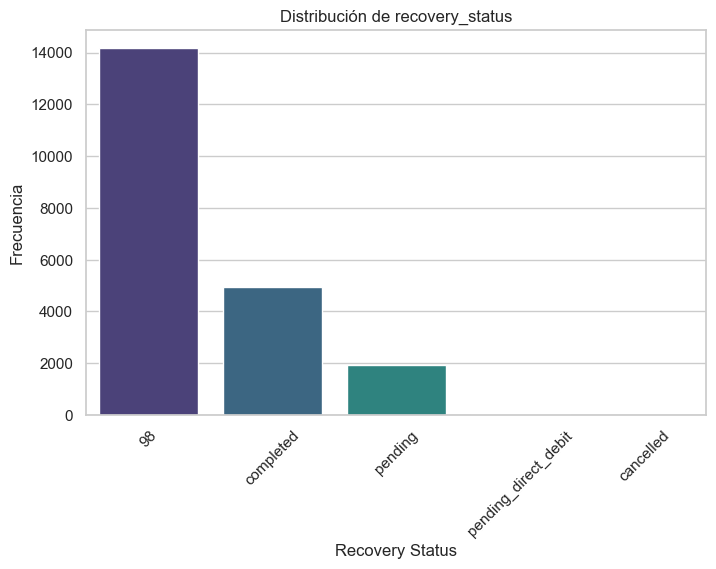

*La mayor parte de los valores se encuentran como que nunca se ha recibido ninguna incidencia sobre ese cash request*

*Sobre los otros posibles valores, se indica si una vez creada la incidencia se ha completado, pendiente, cancelada o pendiente pero con una transferencia SEPA en proceso.

**Análisis Univariado**

`Variables Numericas`

## Resumen de estadísticas de variables numéricas

| Variable            | Count     | Mean          | Std           | Min           | 25%          | 50%          | 75%          | Max           |
|---------------------|-----------|---------------|---------------|---------------|--------------|--------------|--------------|---------------|
| id                 | 21057     | 16318.45      | 6656.15       | 1456.00       | 11745.00     | 17160.00     | 21796.00     | 27010.00      |
| amount             | 21057     | 81.83         | 26.95         | 1.00          | 50.00        | 100.00       | 100.00       | 200.00        |
| deleted_account_id | 21057     | 94634827.00   | 20063077.00   | 3857.00       | 98888889.00  | 98888889.00  | 98888889.00  | 98888889.00   |
| id_fee             | 21057     | 10646.67      | 6099.14       | 1.00          | 5388.00      | 10654.00     | 15926.00     | 21193.00      |
| cash_request_id    | 21057     | 16318.45      | 6656.15       | 1456.00       | 11745.00     | 17160.00     | 21796.00     | 27010.00      |
| total_amount_fee   | 21057     | 5.00          | 0.03          | 5.00          | 5.00         | 5.00         | 5.00         | 10.00         |
| time_diff          | 21057     | 8327430.00    | 3754475.00    | 24.34         | 5172280.00   | 7416928.00   | 11060680.00  | 23307870.00   |

**amount** *tiene un comportamiento sesgado hacia valores altos (mediana en 100). Esto podría afectar la predicción y merece exploración.*

**total_amount_fee** *parece una variable discreta con un rango pequeño (5-10), lo que la hace menos informativa.*

**time_diff** *tiene una variación significativa y podría ser clave en la predicción si se relaciona con recovery_status.*

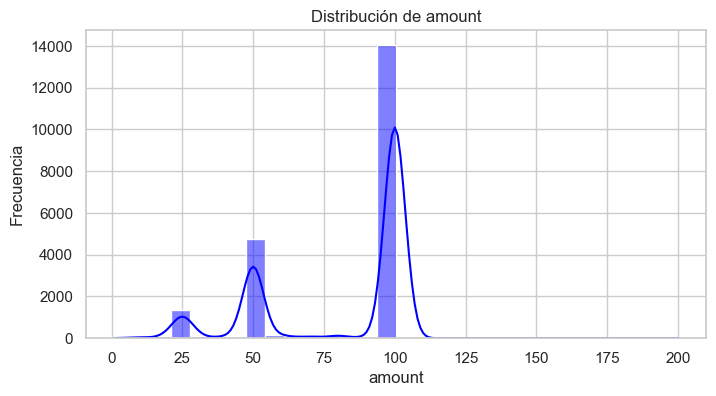

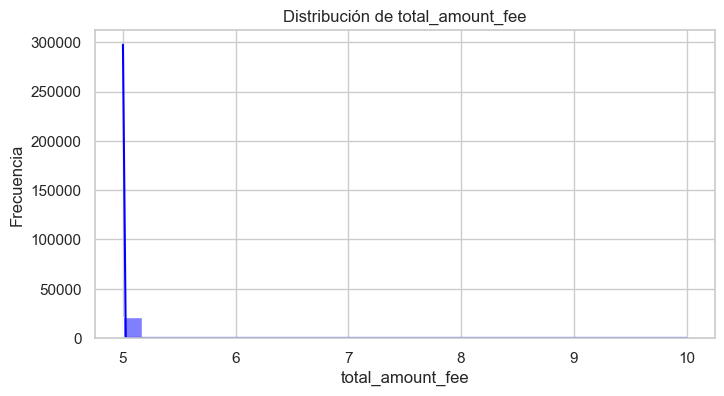

`Variables categóricas`

## Frecuencias de las Variables Categóricas Principales

### **Status**
| Status                   | Frecuencia |
|--------------------------|------------|
| money_back               | 18,918     |
| direct_debit_rejected    | 1,858      |
| active                   | 155        |
| direct_debit_sent        | 72         |
| transaction_declined     | 48         |
| canceled                 | 6          |

---

### **User ID**
| User ID      | Frecuencia |
|--------------|------------|
| Null         | 906        |
| 16391.0      | 37         |
| 15593.0      | 28         |
| 3045.0       | 25         |
| 17144.0      | 24         |
| ...          | ...        |

---

### **Charge Moment Fee**
| Charge Moment Fee | Frecuencia |
|-------------------|------------|
| after            | 16,720     |
| before           | 4,337      |

**Correlación entre variables Numéricas**

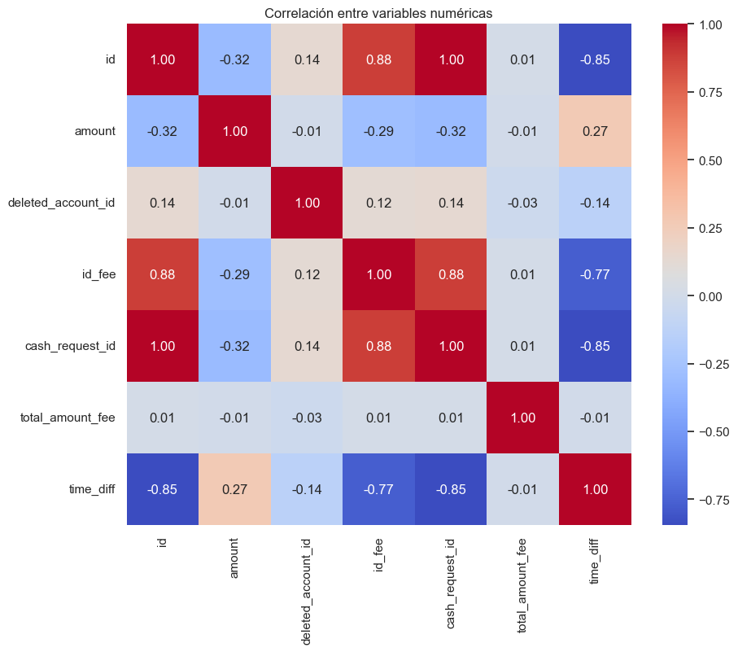

**Distribución de Transfer Type vs Recovery Stats**

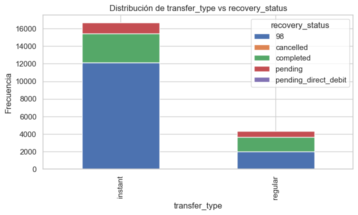

**Distribución de Time Diff vs Recovery Stats**

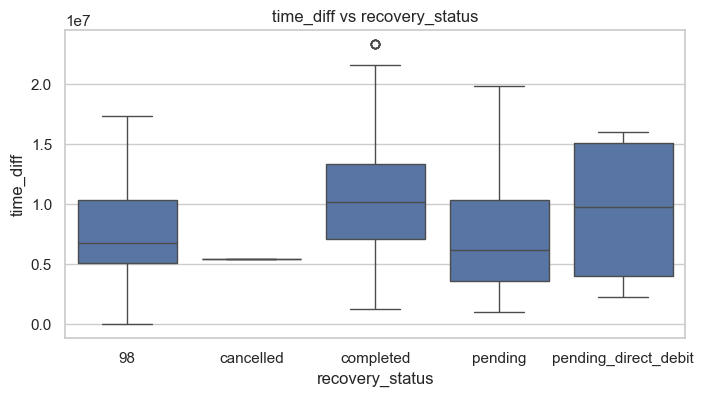

**Variables a tener en cuenta modelo predictivo**

*Ejemplos de variables con un p-value < 0.05 y Chi-cuadrado significativo:*

*moderated_at: chi2=41894.79, p-value=0.000*

*reimbursement_date: chi2=15903.45, p-value=0.000*

*send_at: chi2=69478.84, p-value=0.000*

*type_fee: chi2=5413.51, p-value=0.000*

*status_fee: chi2=9537.93, p-value=0.000*

**Frecuencia de Uso del Servicio segmetado por trimestres**

La frecuencia de uso aumenta drásticamente del segundo al tercer trimestre, pero muestra una ligera reducción en el cuarto trimestre, aunque se mantiene en un nivel alto en comparación con el segundo trimestre. Esto podría indicar un crecimiento inicial en el uso del servicio, seguido de una estabilización.

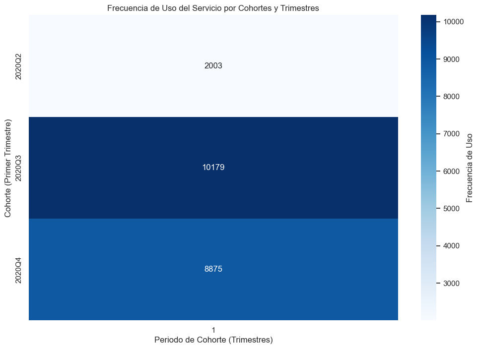

**Tasa de incidentes**

Hay una clara tendencia a la baja en la tasa de incidentes a medida que avanza el tiempo, lo que podría indicar una mejora en la gestión de incidentes o un cambio positivo en las condiciones subyacentes.

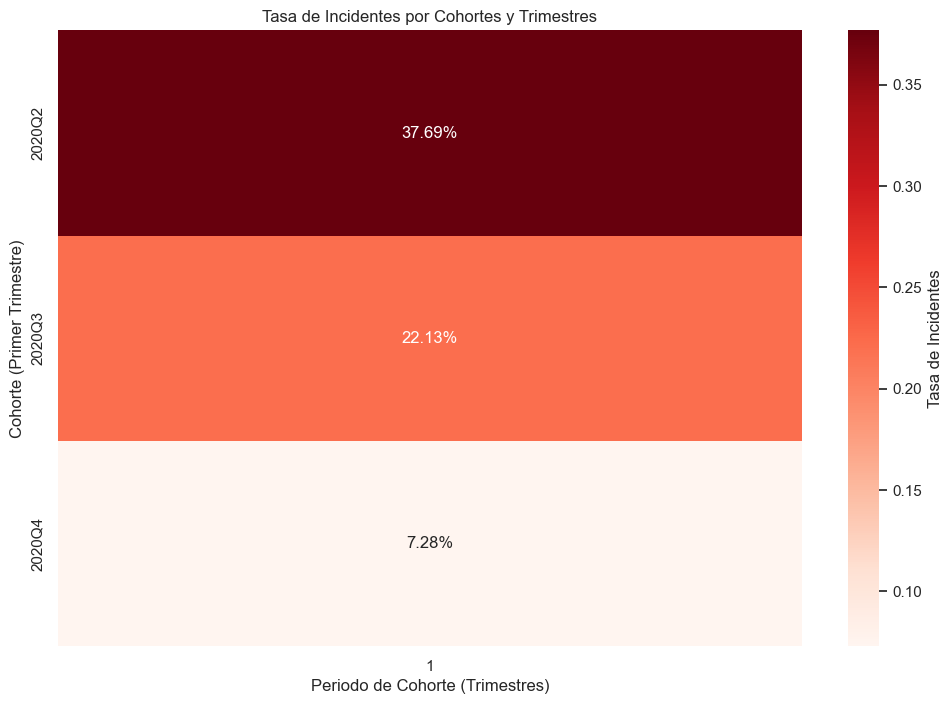

**Ingresos Generados por Cohorte**

La cohorte 2020Q3 generó los mayores ingresos, destacándose como un modelo exitoso que debería replicarse. La cohorte 2020Q4 tiene buen potencial, pero es necesario acelerar la conversión de clientes a estados generadores de ingresos. Optimizar estrategias en cohortes recientes puede maximizar las ganancias futuras.

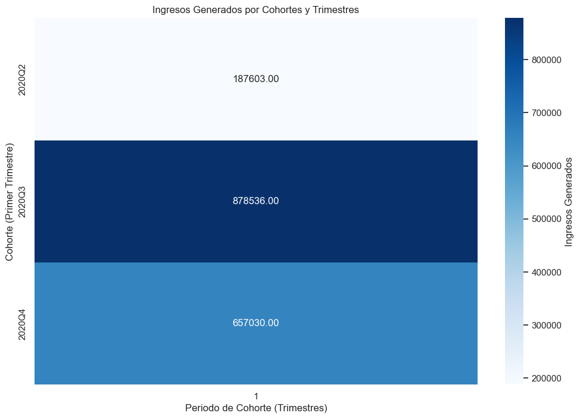

**Frecuencia de Recovery Status por Cohortes y Trimestres**

El estado predominante es 1-98 en todas las cohortes, indicando que la mayoría de los clientes probablemente tienen ese estado inicial o base.

El número de clientes que completaron (1-completed) el proceso parece ser significativo, especialmente en las cohortes 2020Q3 y 2020Q4.

Estados como 1-cancelled y 1-pending_direct_debit son poco frecuentes, mostrando que son escenarios menos comunes en estos datos.

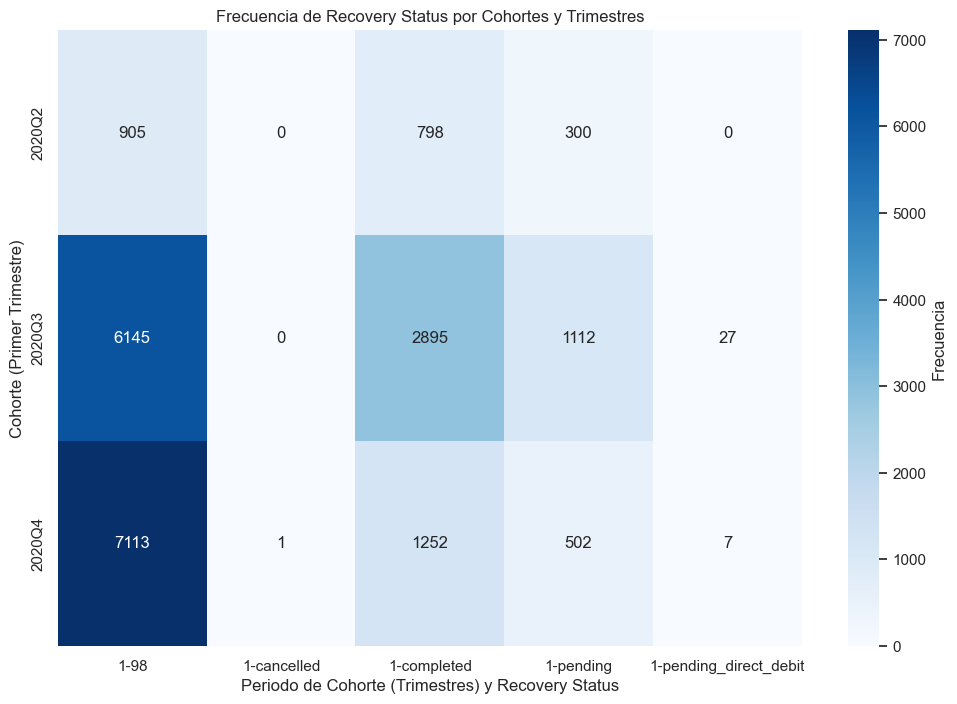

**Proporción de Recovery Status por Cohortes y Trimestres**

Foco en la conversión: Es crucial investigar por qué en la cohorte 2020Q4, la mayoría de los clientes (80%) no avanzan más allá del estado inicial. Podría ser necesario revisar los procesos internos, la experiencia del cliente o las políticas operativas.

Lecciones de cohortes anteriores: Las cohortes 2020Q2 y 2020Q3 muestran mejores tasas de finalización. Analizar lo que funcionó bien en esos períodos podría ayudar a replicar el éxito con nuevas cohortes.

Estrategias proactivas: Diseñar iniciativas específicas para mover a más clientes hacia 1-completed podría mejorar la eficiencia operativa y generar más ingresos. Esto podría incluir automatización, seguimiento personalizado o incentivos para avanzar en el proceso.

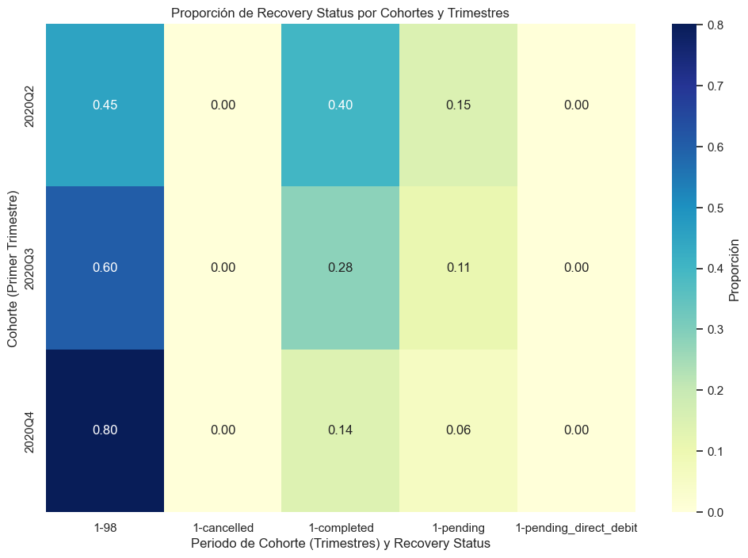

**Frecuencia de Ingresos por semana**

El servicio tiene una tendencia ascendente en la frecuencia de ingresos por semana, con un aumento significativo en los trimestres.

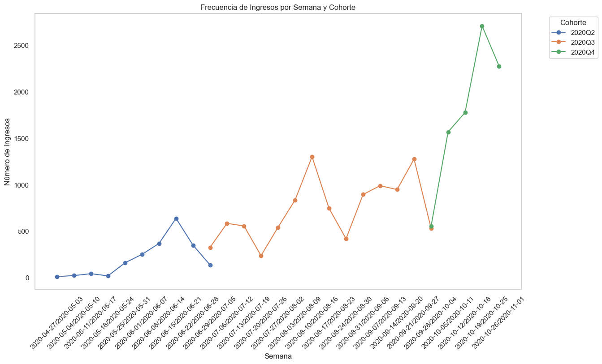

**Elasticidad Temporal de ingresos por semana**

En la semana que incluye el 2020-05-10, la elasticidad temporal alcanza un pico muy alto (superior a 7), sugiriendo un evento o campaña que provocó un gran aumento en los ingresos.

En general, los ingresos son estables a lo largo del tiempo, con oscilaciones moderadas.

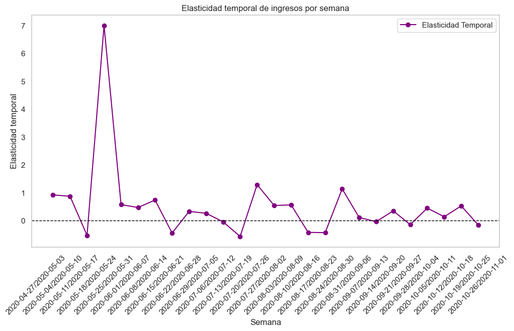

**Series Temporales de Tipos de Usuario**

Observamos la clara diferencia de Tendencia entre los nuevos usuarios y la recurrencia de los usuarios ya existentes, indicativo que la captación de nuevos usuarios esta funcionando muy bien pero no se esta logrando la recurrencia de los usuarios ya existentes.

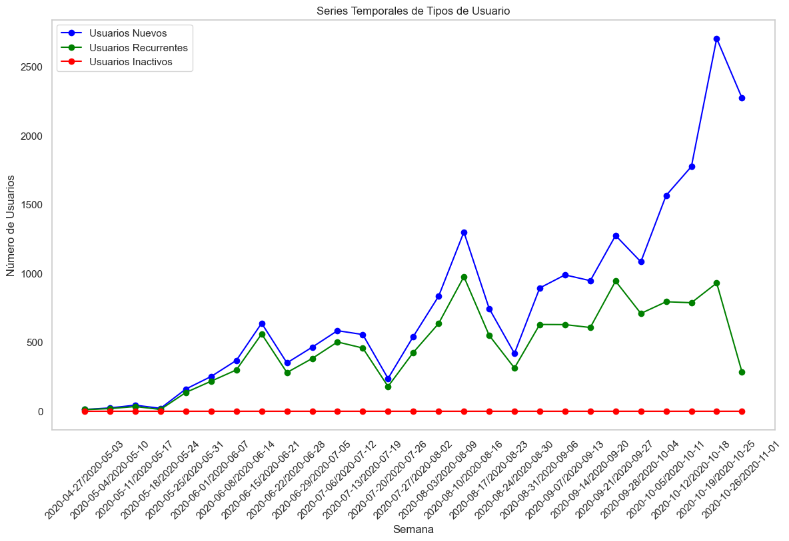

**Predicciones Tipos de Usuario**

Vemos como a pesar de la creciente tendencia que se mantiene sobre los nuevos usarios, cuesta incrementar la retención de ellos, indicativo para mejorar la experiencia de usuario y la calidad del servicio.

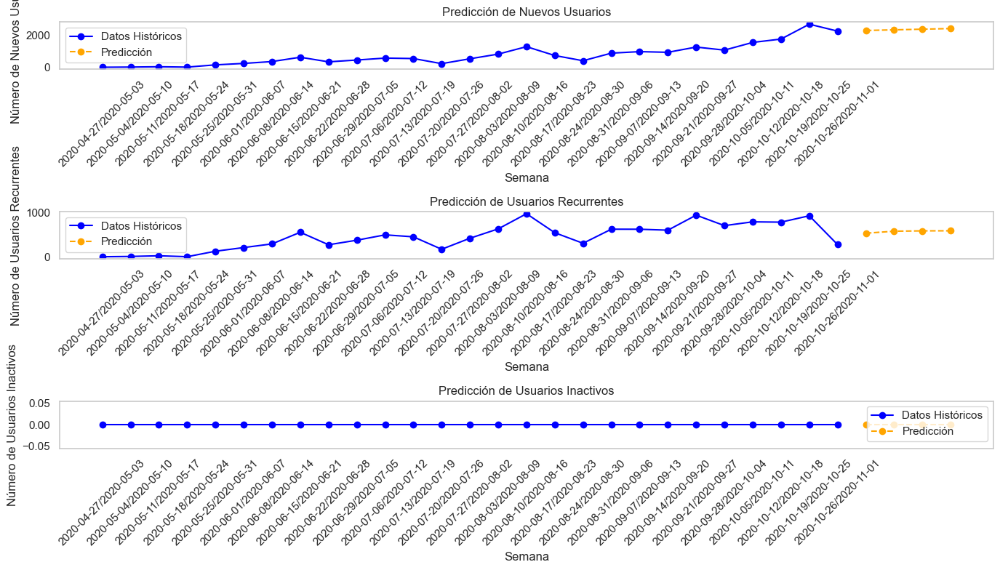

**Distribución de Segmentos de Usuario (RFM)**

Observamos como la mayor parte de los usuarios se encuentran en el segundo segmento mas bajo del Estudio, lo que nos podria dar un indicio de que la estrategia de marketing actual no esta siendo efectiva para atraer a todos esos clientes potenciales.

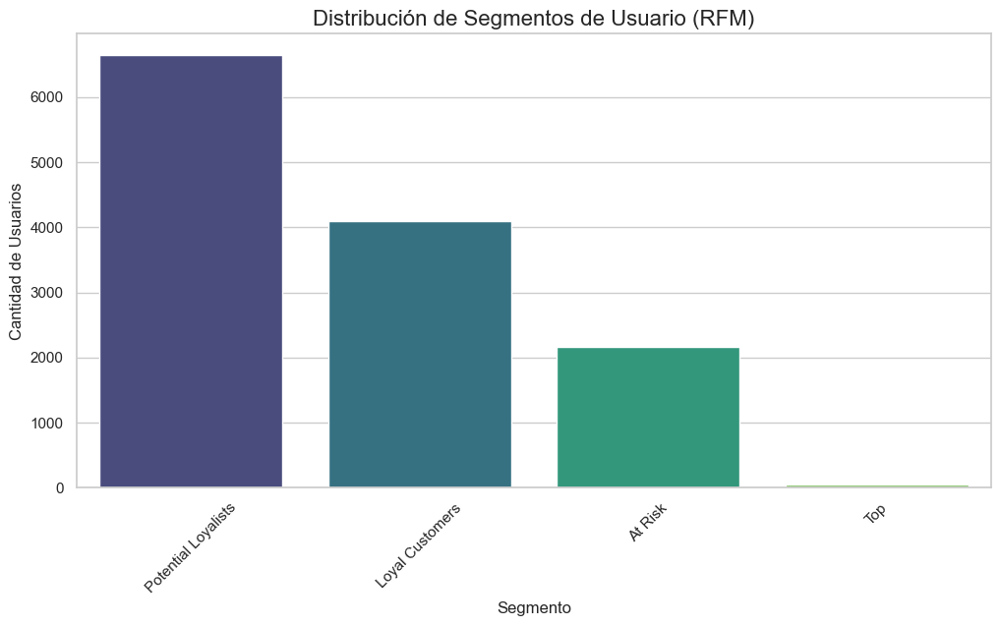

**Distribución de Segmentos de Usuario Potential Loyalist (RFM)**

Recency: Muchos clientes están activos recientemente, lo que sugiere un buen nivel de retención.
Frequency: La baja frecuencia general indica que los clientes interactúan pocas veces y podrían necesitar incentivos para incrementar la frecuencia.
Monetary: Aunque el gasto promedio es moderado, los valores atípicos altos representan clientes con un mayor potencial económico.

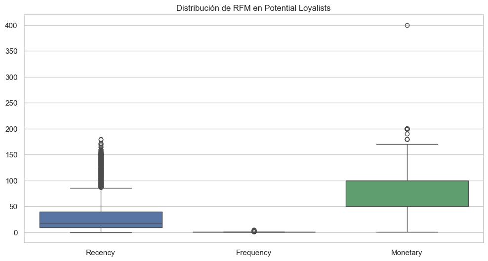

**Comparación en Gasto de Segmentos de Usuario (RFM)**

Al igual que en la Distribución de los Segmentos de usuario, esa gran masa donde se encuentran los perfiles que pueden ser potencialmente clientes son los perfiles que estan gastando más en nuestro servicio.

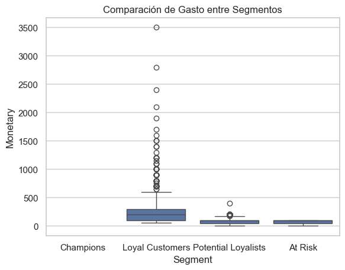